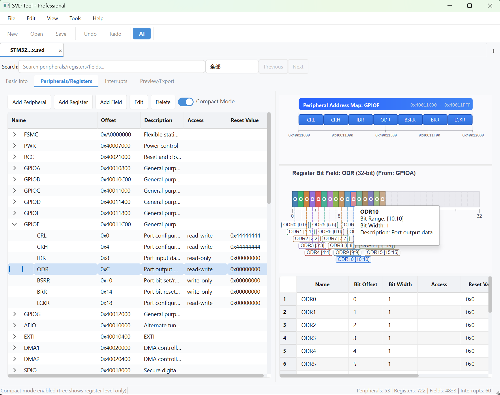
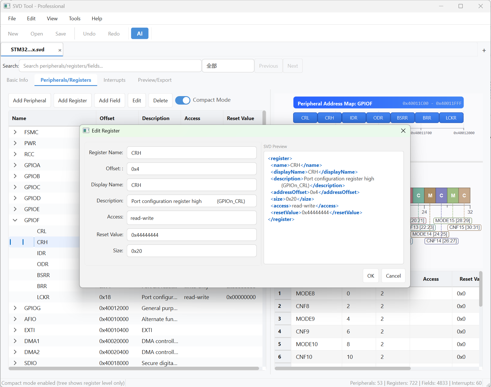
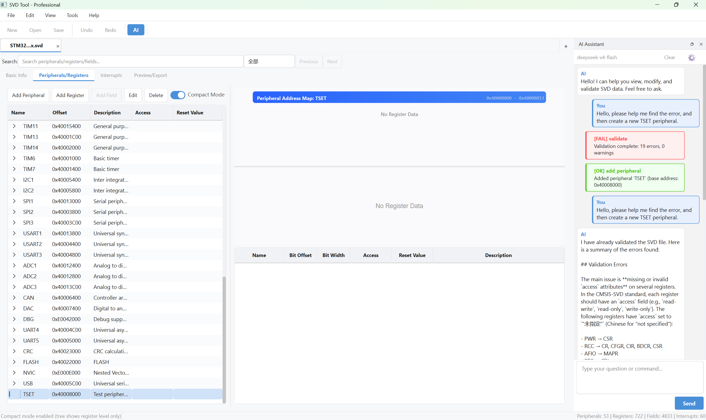

<!-- README.md - English Version -->
<div align="center">

# SVD Editor

[](README.md)
[](README_zh.md)
[](https://www.python.org/)
[](https://www.riverbankcomputing.com/software/pyqt/)
[](LICENSE)

**A professional CMSIS-SVD parsing, editing, visualization, and CLI tool. Supports peripheral management, register editing, bitfield visualization, batch operations, diff/merge, C header generation, and more.**

[View in Chinese](README_zh.md)

</div>

---

## Screenshots

> Add screenshots here to showcase the GUI features

<!--  -->
<!--  -->
<!--  -->

---

## Features

### GUI Editor

| Feature | Description |
|---------|-------------|
| **SVD/XML Parsing** | Import standard CMSIS-SVD files, parse device/peripheral/register/field hierarchy |
| **Visual Tree Editing** | Three-level tree view (Peripheral -> Register -> Bitfield) with full CRUD |
| **Inherited Peripheral Support** | Auto-merge registers from `derivedFrom` base peripherals |
| **Address Map Visualization** | Graphical peripheral address space layout with register offsets |
| **Bitfield Visualization** | Register bitfield diagrams with highlight and editing |
| **Interrupt Management** | Configure and manage interrupt vectors |
| **Undo/Redo** | Unlimited operation history with snapshot recovery |
| **Advanced Search** | Unified search syntax (`type:periph name:GPIO* addr:0x4001*`) with structured and full-text modes |
| **Batch Operations** | Batch modify, batch generate registers, batch clone across peripherals |
| **Chain Rules** | Cascading delete/modify rules with configurable actions |
| **Drag-and-Drop Sorting** | Reorder peripherals and registers via drag-and-drop |
| **Multi-document Tabs** | Open and switch between multiple SVD files |
| **Real-time Preview** | Live XML preview with syntax highlighting |
| **Dark/Light Theme** | Built-in theme switching with modern flat UI |

### AI Assistant

The built-in AI assistant provides natural language interaction for SVD data operations. Simply describe what you want to do in plain language, and the AI will execute the corresponding operations.

**Key Capabilities:**

| Capability | Example |
|------------|---------|
| **Query & Search** | "Show me all peripherals", "Find registers with offset 0x10" |
| **CRUD Operations** | "Add a new peripheral named TIMER0", "Delete register MODER" |
| **Validation** | "Validate this SVD file", "Check for address conflicts" |
| **Batch Operations** | "Rename all GPIO peripherals", "Fix all address conflicts" |
| **Multi-document** | "Switch to STM32F4.svd", "Diff with the other open file" |
| **Navigation** | "Jump to UART1", "Show register MODER in GPIOA" |

**Supported Providers:**
- OpenAI (GPT-4o, GPT-4o-mini, etc.)
- Anthropic (Claude 3.5 Sonnet, Claude 3 Haiku, etc.)
- Any OpenAI-compatible API (Ollama, vLLM, etc.)

**Configuration:**
- API key and endpoint configuration via Settings dialog
- Streaming response support
- Custom system prompt extensions
- Conversation history management

### CLI Commands (CI/CD Ready)

| Command | Description |
|---------|-------------|
| `validate` | Validate SVD against CMSIS-SVD schema (bitfield overlap, address conflicts, required fields) |
| `export` | Export to CSV, Markdown, or HTML documentation |
| `generate` | Regenerate/formatter SVD XML |
| `diff` | Compare two SVD files for structural differences |
| `info` | Display device info and statistics |
| `merge` | Merge two SVD files with configurable conflict strategy |
| `header` | Generate C header files from SVD |
| `conflicts` | Detect address overlaps, register offset duplicates, bitfield conflicts |
| `extract` | Extract specific peripherals into a new SVD file |
| `create` | **Create new SVD from JSON data** (e.g. from AIfull_link) |
| `add-peripheral` | Add peripherals from JSON to existing SVD |
| `update-peripheral` | Update peripheral properties (base address, description, etc.) |
| `remove-peripheral` | Remove peripherals from SVD by name |
| `add-register` | Add registers to a peripheral (from JSON or CLI args) |
| `update-register` | Update register properties (offset, size, access, etc.) |
| `remove-register` | Remove registers from a peripheral by name |
| `add-field` | Add bitfields to a register (from JSON or CLI args) |
| `update-field` | Update bitfield properties (bit offset, bit width, access, etc.) |
| `remove-field` | Remove bitfields from a register by name |

### Output & Export

- **SVD Generation**: Well-formatted, indented SVD/XML output
- **Documentation Export**: CSV, Markdown, HTML register documentation
- **C Header Generation**: `#define` macros for register addresses and bitfield masks
- **Diff Reports**: Text or JSON difference reports

---

## AIfull_link Integration

Create SVD files directly from [AIfull_link](https://github.com/SamyiHu/AIfull_link) parsed register data:

```bash
# 1. In AIfull_link, export register data as JSON
#    (use export_svd tool in Agent Shell)

# 2. Create SVD from the exported JSON
python run.py create --data scf10t_svd_data.json -o SCF10T.svd --validate

# 3. Open in GUI for visual editing
python run.py --gui --file SCF10T.svd
```

The JSON format is compatible with `DeviceInfo.to_dict()` output. See `data_model.py` for schema details.

---

## Installation & Running

### Requirements

- Python 3.10+
- PyQt6 6.5.0+

### Quick Start

```bash
git clone https://github.com/SamyiHu/SVDEditor.git
cd SVDEditor
pip install PyQt6
python run.py                # GUI mode
python run.py info file.svd  # CLI mode
```

### AI Assistant Setup

```bash
# Install optional AI dependencies
pip install openai anthropic

# Configure API key (via GUI Settings or environment variable)
export OPENAI_API_KEY="your-api-key"
```

---

## CLI Usage

<details>
<summary><b>Basic Commands</b></summary>

```bash
# Validate
python run.py validate chip.svd [--json] [--strict]

# Export documentation
python run.py export chip.svd --format markdown -o registers.md
python run.py export chip.svd --format csv --peripheral GPIOA --summary-only

# Regenerate SVD
python run.py generate chip.svd -o output.svd

# Diff two versions
python run.py diff chip_v1.svd chip_v2.svd [--json] [--ignore-description]

# Device info
python run.py info chip.svd [--json]

# Merge SVD files
python run.py merge target.svd source.svd --strategy source -o merged.svd

# Generate C header
python run.py header chip.svd --style upper_case --prefix CHIP_ -o device.h

# Check address conflicts
python run.py conflicts chip.svd [--json] [--strict]

# Extract peripherals
python run.py extract chip.svd --peripherals GPIOA,GPIOB,GPIOC -o gpio.svd
```

</details>

<details>
<summary><b>Advanced Commands</b></summary>

```bash
# Create SVD from JSON (e.g. exported from AIfull_link)
python run.py create --data device_data.json -o chip.svd [--validate] [--open]

# Add peripherals from JSON
python run.py add-peripheral chip.svd --data peripheral.json -o updated.svd

# Remove peripherals
python run.py remove-peripheral chip.svd --name GPIOC,GPIOD -o updated.svd

# Update peripheral properties
python run.py update-peripheral chip.svd -n GPIOA --base-address 0x48010000 -o updated.svd

# Add register (from CLI args)
python run.py add-register chip.svd -p GPIOA --name IDR --offset 0x10 --desc "Input data" -o updated.svd

# Add register (from JSON)
python run.py add-register chip.svd -p GPIOA --data registers.json -o updated.svd

# Update register properties
python run.py update-register chip.svd -p GPIOA -n MODER --offset 0x08 --size 0x20 -o updated.svd

# Remove registers
python run.py remove-register chip.svd -p GPIOA --names OTYPER,OSPEEDR -o updated.svd

# Add bitfield (from CLI args)
python run.py add-field chip.svd -p GPIOA -r MODER --name MODE7 --bit-offset 14 --bit-width 2 -o updated.svd

# Update bitfield properties
python run.py update-field chip.svd -p GPIOA -r MODER -n MODE0 --bit-width 1 --access read-write -o updated.svd

# Remove bitfields
python run.py remove-field chip.svd -p GPIOA -r MODER --names MODE0,MODE1 -o updated.svd
```

</details>

<details>
<summary><b>GUI Mode</b></summary>

```bash
# Open GUI with a specific file
python run.py --gui --file chip.svd
```

</details>

---

## Keyboard Shortcuts (GUI)

| Shortcut | Action |
|----------|--------|
| `Ctrl+N` | New SVD file |
| `Ctrl+O` | Open file |
| `Ctrl+S` | Save file |
| `Ctrl+Z` | Undo |
| `Ctrl+Y` | Redo |
| `Ctrl+F` | Quick search |
| `Ctrl+H` | Advanced search |
| `Ctrl+Shift+G` | Go to address |
| `F5` | Refresh view |

---

## Project Structure

```
SVDEditor/
├── run.py                          # Entry point (GUI + CLI)
├── svd_tool/
│   ├── cli.py                      # CLI module (19 commands)
│   ├── main.py                     # GUI entry
│   ├── core/
│   │   ├── data_model.py           # Device, Peripheral, Register, Field
│   │   ├── svd_parser.py           # SVD parser
│   │   ├── svd_generator.py        # SVD generator
│   │   ├── svd_schema_validator.py # Schema validation
│   │   ├── svd_exporter.py         # CSV/Markdown/HTML export
│   │   ├── svd_differ.py           # Diff engine
│   │   ├── svd_merger.py           # Merge engine
│   │   ├── header_generator.py     # C header generator
│   │   ├── address_conflict_detector.py  # Conflict detection
│   │   ├── chain_rules.py          # Chain rules engine
│   │   ├── document_manager.py     # Multi-document manager
│   │   └── command_history.py      # Undo/Redo
│   ├── ai_assistant/
│   │   ├── __init__.py             # Module entry
│   │   ├── config.py               # AI configuration
│   │   ├── backend.py              # API backend (OpenAI/Anthropic)
│   │   ├── controller.py           # AI controller
│   │   ├── prompt_builder.py       # System prompt builder
│   │   ├── command_executor.py     # Operation executor
│   │   ├── chat_history.py         # Chat history management
│   │   └── widgets/
│   │       ├── chat_panel.py       # Chat panel UI
│   │       ├── chat_bubble.py      # Chat bubble widget
│   │       └── settings_dialog.py  # AI settings dialog
│   ├── ui/
│   │   ├── main_window_refactored.py     # Main window
│   │   ├── components/
│   │   │   ├── state_manager.py          # State management
│   │   │   ├── layout_manager.py         # Layout coordination
│   │   │   ├── tab_builder.py            # Tab page construction
│   │   │   ├── ui_updater.py             # UI update coordination
│   │   │   └── menu_bar.py / toolbar.py  # Menu & toolbar
│   │   ├── managers/
│   │   │   ├── search_manager.py         # Search (quick + advanced)
│   │   │   ├── batch_operations_manager.py  # Batch operations
│   │   │   ├── file_operations.py        # File I/O
│   │   │   └── register_manager.py       # Register management
│   │   ├── dialogs/
│   │   │   ├── chain_rules_dialog.py     # Chain rules editor
│   │   │   ├── svd_diff_merge_dialog.py  # Diff & merge dialog
│   │   │   └── new_svd_wizard.py         # New file wizard
│   │   └── widgets/
│   │       ├── bit_field_widget.py       # Bitfield visualization
│   │       ├── address_map_widget.py     # Address map
│   │       ├── document_tab_bar.py       # Multi-document tabs
│   │       └── welcome_page.py           # Welcome page
│   ├── config/
│   │   ├── about.json              # About dialog config
│   │   └── styles.py               # Theme/style system (dark/light)
│   └── i18n/
│       ├── i18n.py                 # i18n manager
│       ├── zh_CN.json              # Chinese translations
│       └── en_US.json              # English translations
├── docs/                           # Documentation
├── build_tools/                    # PyInstaller build scripts
├── test_data/                      # Test SVD files
└── tests/                          # Test suite
```

---

## Building

See [BUILD_INSTRUCTIONS.md](docs/BUILD_INSTRUCTIONS.md) for detailed build instructions.

```bash
pip install pyinstaller
cd build_tools
python build_professional_fixed.py
```

---

## License

Apache License 2.0 - see [LICENSE](LICENSE) for details.

## Maintainer

- SamyiHu ([@SamyiHu](https://github.com/SamyiHu))

---

<div align="center">

**Enjoy using SVD Editor!**

[](README.md)
[](README_zh.md)

</div>
